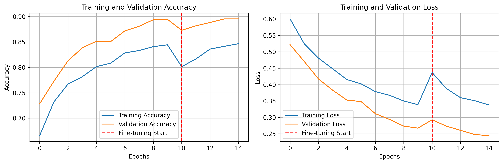
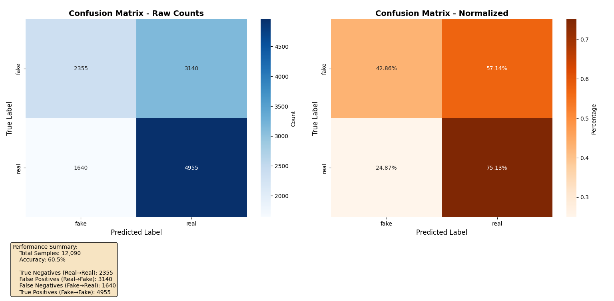

# Advanced Deepfake Video Detector

An end-to-end deep learning project for detecting deepfake videos using Python, TensorFlow, and OpenCV, complete with a trained EfficientNetV2B0 model and a Tkinter desktop analysis tool.

 
*Note: You should replace the line above with a screenshot or GIF of your application in action.*

---

## 📖 Table of Contents
- [About The Project](#about-the-project)
- [Key Features](#key-features)
- [Tech Stack](#tech-stack)
- [Project Structure](#project-structure)
- [Results & Performance](#results--performance)
- [Getting Started](#getting-started)
  - [Prerequisites](#prerequisites)
  - [Installation](#installation)
- [Usage](#usage)
  - [1. Consolidate Dataset](#1-consolidate-dataset)
  - [2. Train the Model](#2-train-the-model)
  - [3. Evaluate the Model](#3-evaluate-the-model)
  - [4. Run the Application](#4-run-the-application)
- [License](#license)
- [Acknowledgments](#acknowledgments)

---

## 🧐 About The Project

In an age where digital misinformation is a growing concern, this project tackles the challenge of identifying manipulated videos head-on. This repository contains a complete system to train a deep learning model and use it in a desktop application to classify videos as either "real" or "fake".

The core of the project is a deep learning model built using the **EfficientNetV2B0** architecture and transfer learning. The model is trained on a processed subset of the FaceForensics++ dataset. A user-friendly desktop application provides a practical interface for analyzing new video files.

---

## ✨ Key Features

* **Transfer Learning:** Leverages the pre-trained EfficientNetV2B0 model for powerful feature extraction and high performance.
* **Robust Data Pipeline:** Includes scripts to automatically sample videos, detect faces using OpenCV's DNN module, and apply quality filters (for size and blurriness) to create a clean image dataset for training.
* **Two-Phase Training:** Employs a strategic training process involving initial training of the classification head followed by fine-tuning of the base model for optimal results.
* **Desktop GUI Application:** A user-friendly application built with Tkinter allows users to select and analyze video files in real-time.
* **Responsive UI:** Uses multi-threading to perform heavy analysis in the background, ensuring the application interface remains responsive.

---

## 🛠️ Tech Stack

* **Backend & ML:** Python, TensorFlow, Keras, Scikit-learn
* **Computer Vision:** OpenCV
* **Data Handling:** NumPy
* **GUI:** Tkinter
* **Plotting:** Matplotlib, Seaborn

---

## 📂 Project Structure

Deepfake-Video-Detector/
├── processed_images/         # (Generated) Stores extracted faces for training
├── video_dataset/            # (Generated) Stores the sampled video dataset
│
├── best_deepfake_model_effnet.keras  # The final trained model
├── consolidate_dataset.py    # Script to sample and consolidate videos
├── analyze_dataset.py        # Script to filter videos with no usable faces
├── train_model.py            # Main script to preprocess data and train the model
├── confusion_matrix.py       # Script to evaluate the model and create plots
├── desktop_app.py            # The Tkinter GUI application script
│
├── deploy.prototxt           # Face detector model structure
├── res10_300x300_ssd_iter_140000.caffemodel # Face detector model weights
│
├── training_history.png      # (Generated) Plot of training/validation accuracy and loss
├── Confusion Matrix.png      # (Generated) Confusion matrix of the model's performance
└── README.md                 # This file

## 📊 Results & Performance

The model was trained for a total of 15 epochs (10 initial, 5 fine-tuning) and achieved a final **validation accuracy of 89.5%**.

#### Training History


#### Evaluation on Test Data
On a balanced test set of 12,090 images, the model achieved an **overall accuracy of 60.5%**. The confusion matrix below shows the detailed breakdown of its predictions.



---

## 🚀 Getting Started

Follow these instructions to get a copy of the project up and running on your local machine.

### Prerequisites

* Python (3.8 or newer recommended)
* `pip` and `venv`

### Installation

1.  **Clone the repository:**
    ```sh
    git clone [https://github.com/your-username/Deepfake-Video-Detector.git](https://github.com/your-username/Deepfake-Video-Detector.git)
    cd Deepfake-Video-Detector
    ```

2.  **Download Face Detector Files:**
    The OpenCV DNN face detector files (`deploy.prototxt` and `res10_300x300_ssd_iter_140000.caffemodel`) are required. Download them and place them in the root project directory. You can find them in the [OpenCV GitHub repository](https://github.com/opencv/opencv/tree/master/samples/dnn/face_detector).

3.  **Set up a Virtual Environment:**
    ```sh
    # For Windows
    python -m venv venv
    .\venv\Scripts\Activate.ps1

    # For macOS/Linux
    python3 -m venv venv
    source venv/bin/activate
    ```

4.  **Install Dependencies:**
    ```sh
    pip install tensorflow opencv-python scikit-learn matplotlib seaborn
    ```

5.  **Place the Trained Model:**
    Ensure the `best_deepfake_model_effnet.keras` file is in the root directory.

---

## ⚙️ Usage

### 1. Consolidate Dataset
To create your own video dataset from a source like FaceForensics++, configure the paths in `consolidate_dataset.py` and run it.
```sh
python consolidate_dataset.py


2. Train the Model
To train the model from scratch, first ensure your video_dataset is ready. Then, configure the parameters in train_model.py and run it. This will first preprocess the videos into the processed_images folder and then start training.
python train_model.py
